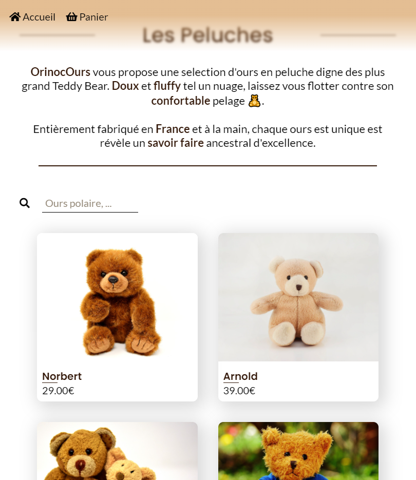
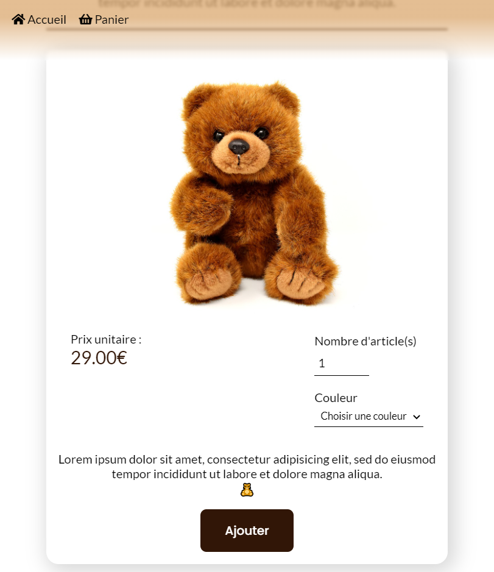
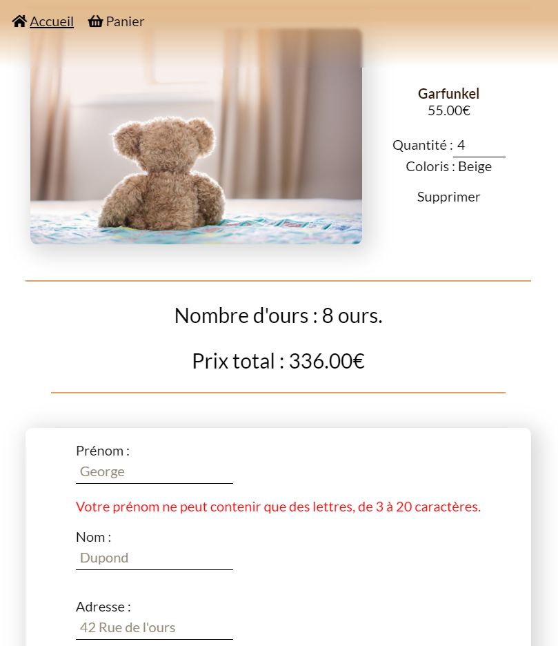

# Oniroco

## Fifth project with Openclassrooms (optionnal, teddy option)

For this project, the back is provided. The work was to provide the full front side of the web site and dynamically integrate the elements of the API on pages with JavaScript and set up an acceptance test plan.

### Back end Prerequisites

You will need to have Node and npm installed locally on your machine.

### Back end Installation

Clone this repo. From the "back" folder of the project, run npm install. You can then run the server with node server. The server should run on localhost with default port 3000. If the server runs on another port for any reason, this is printed to the console when the server starts, e.g. Listening on port 3001.

#### The web application will consist of 4 pages.

-   A home page showing (dynamically) all the articles available at the sale.
-   A “product” page which displays (dynamically) the details of the product on which the user clicked from the home page. From this page, the user can select a quantity, a color, and add the product to his basket.
-   A “shopping cart” page. This contains several parts:

*   A summary of the products in the cart, the total price and the possibility of modify the quantity of a selected product or delete it.
*   A form for placing an order. Data from form must be correct and well formatted before being returned to the back-end. For example, no number in a first name field.

-   A “confirmation” page:

*   An order confirmation message thanking the user for his order, and indicating the order ID sent by the API.

## Technologies

-   HTML, CSS and Javascript only (no framework).

## Preview

